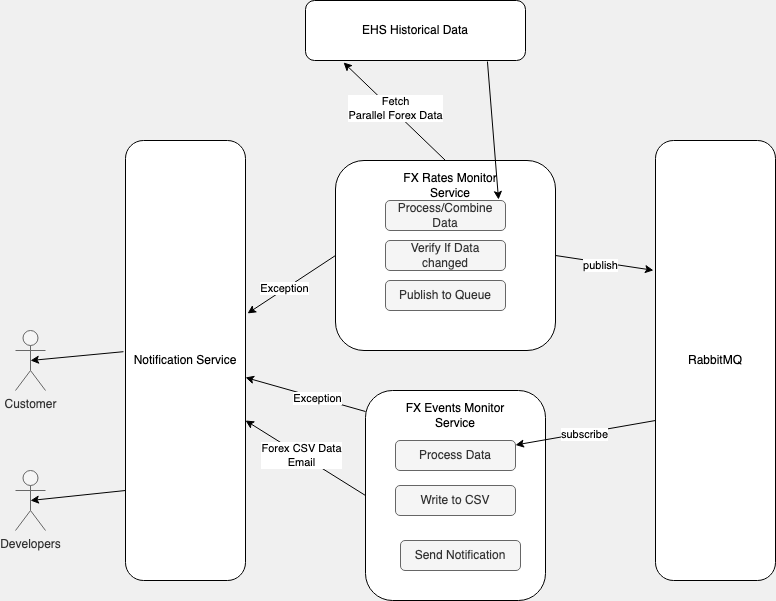

High level Design

Major Design concepts
- Not blocking
- Reactive nature.
- Controlled through configuration.
  - Http connect timeout, socket timeout.

There are total five docker instances in the whole application.

RabbitMQ

RabbitMQService
Contains all configuration related to Rabbit MQ
- Queue creation
- Topic Creation
- Exchange creation 

FxRatesMonitor
- Rates Engine
  - EHS Query process
    - I have checked responses from the EHSHistoricalData and its changing every minute.
    - Wrote a scheduler which queries all the list of Forex Data of interest every one minute.
    - Query the EHS historical site independently.
    - Used reactor framework which is follow reactive principles and can scale well
  - Combine Data
    - Combine the responses from all the forex data and compare with the previous data
  - Push to Rabbit Queue on the fxevent exchanger.
  - Any exception/error during this process send a notification message using notification service developers about the exception.
  - Control the list of forexs through configuration
  - Control the notification data (from address, to address everything through configuration)

FXEvents Monitor
- Events Engine
  - Events Reader
    - Read from Queue - 
    - Keep it independent so that we can change implementation later if needed  
  - Process Information
    - process the queue data and change if required
    - Write to CSV - Used Open CSV  
    - Can plug and play any another service here
  - Send to notification service
    - Populate notification data
    - Send to notification service with the location of the attachment

Notification Service
- Rest service
- State less
- Scaled independently
- We persist the incoming data, in case we want reliability.
- We enhance this service to support other modes of delivery
    - sms
    - slack
- Request data is JSON and change content as required.
- Separation of concerns and single responsibility principles
- SOLID
- Global exception handler in rest service to handle all errors.
- POST service - Not Idempotent.

List of enhancements 
- Validate the Forex configuration by retrieving the list of forexes supported and checking them.
- We can use Rabbit MQ for notification messages, since i felt its much better suitable for scalability
- Do you think kafka can work better instead of MQ 
  - Scalability
  - Back pressure
   https://doordash.engineering/2020/09/03/eliminating-task-processing-outages-with-kafka/
- Persistence of messages across various layers. RabbitMQ and notification service to improve reliability
- Using Orchestration framework like Kubernetes to manage the various services.
- Acknowledgment of various steps across the services to make sure steps are followed.
- If EHSHistoricalData support push mechanism instead of pooling it would improve performance.Probably web hooks
- If more messages and types needs to supported we can use the further topics and queues to handle data appropriately.
- Write a common library which can be used across these four modules.
- 

Design Principles
SOLID principles

Testing 
Used MockWebServer for testing the notification service

Repositories
We can use a separate repository for each service
Probably use git submodules?

Notification Service
Kafka vs RabbitMQ
Better to use Kafka

Docker container

Design
Websocket connection from the spring server to all the different rest services.
Collect the data for every one min in a asynchronous way.
check if the data has changes from previous and send only if the content has changed.

